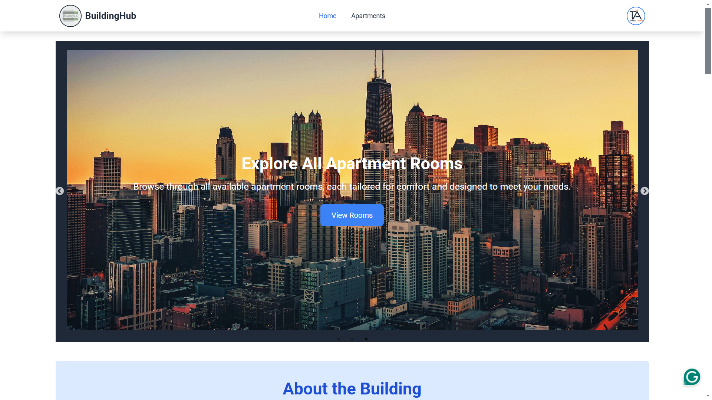

# Building Management System - Frontend



## Project Overview

The **Building Management System (BMS)** is designed to simplify the management of a single building by providing seamless experiences for both users and admins. This project emphasizes user-friendly navigation, responsive design, and advanced functionalities.

---

## 🔗 **Live Site URL**

[https://buildinghub.netlify.app](#)

---

---

## 🔗 Collect this email for see the admin route

turjo@admin.com
admin pass: Turjo123

---

## 🛠️ **Key Features**

1. **Responsive Design:** Fully optimized for mobile, tablet, and desktop views.
2. **Dynamic Navbar:** Displays the user's profile picture and conditional navigation items.
3. **Fancy Banner:** Features automatic sliding images for an engaging UI.
4. **About Section:** Detailed building description with attractive typography.
5. **Coupons Section:** Showcases available coupons in a visually appealing format.
6. **Location Section:** Provides details about the apartment’s location with optional map integration.
7. **Authentication System:** Includes login, registration, and Google/GitHub authentication.
8. **Apartment Listing:** Displays rooms with filtering, pagination, and agreement functionality.
9. **Sweet Alerts/Toasts:** Notifies users of CRUD operations, login success, and registration completion.
10. **Secure Configuration:** Firebase and API credentials are stored using environment variables.

---

## 📝 **Technology Stack**

- **Framework:** React.js
- **State Management:** Context API
- **Data Fetching:** TanStack Query
- **CSS Framework:** Tailwind CSS
- **UI Components:** DaisyUI
- **Toast/Alerts:** React-Toastify / SweetAlert2
- **Authentication:** Firebase Authentication
- **Icons:** React Icons

---

## 📄 **Environment Variables**

Ensure to set up the following variables in a `.env` file for secure access:

```env
REACT_APP_FIREBASE_API_KEY=your_firebase_api_key
REACT_APP_FIREBASE_AUTH_DOMAIN=your_auth_domain
REACT_APP_FIREBASE_PROJECT_ID=your_project_id
REACT_APP_FIREBASE_STORAGE_BUCKET=your_storage_bucket
REACT_APP_FIREBASE_MESSAGING_SENDER_ID=your_sender_id
REACT_APP_FIREBASE_APP_ID=your_app_id
```

## Step-by-Step Guide to Run the Project Locally

1. **Clone the Repository:**

   - Open your terminal or command prompt and clone the repository to your local machine using the following command:
     ```bash
     git clone https://github.com/tareqahmed2/buildingHub-client-side
     ```

2. **Navigate to the Project Directory:**

   - After cloning the repository, go into the project folder:
     ```bash
     cd <project-folder>
     ```

3. **Install Dependencies for Client-Side:**

   - Navigate to the `client` folder:
     ```bash
     cd client
     ```
   - Install the necessary dependencies for the frontend:
     ```bash
     npm install
     ```

4. **Install Dependencies for client-Side:**

   - Now, go to the `server` folder:
     ```bash
     cd ../client
     ```
   - Install the required dependencies for the frontend:
     ```bash
     npm install
     ```

5. **Set Up Environment Variables:**

   - Create a `.env` file in the root directory of both the `client` and `server` folders.
   - Add the necessary environment variables such as API keys and database URIs.

   Example for **Client (`client/.env`):**

   ```env
   REACT_APP_API_URL=http://localhost:5000
   ```
